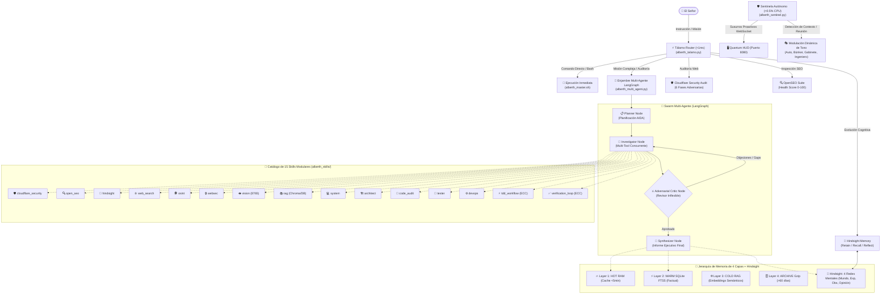

# 🤖 ALBERTH v4.0 · BÚNKER DE ORQUESTACIÓN MULTI-AGENTE & MEMORIA EVOLUTIVA
_Sistema Nervioso Central y Orquestador Operativo Autónomo de Novasyscom_
_Gobernanza: El Señor | Bóveda Obsidian: [[00 - HUB NOVASYSCOM (Cerebro Digital)|HUB Maestro]]_

---

> [!INFO] **Visión General de la Bóveda en Obsidian**
> Alberth ha evolucionado de un script de asistencia a un **Ecosistema Multi-Agente Distribuido de Nivel Militar** con enrutamiento tálamico sub-milisegundo, memoria evolutiva cuádruple, auditoría de seguridad adversaria y telemetría 3D geoespacial.



---

## 🧭 Mapa de Navegación de Nodos en Obsidian

| Módulo / Documento | Tipo de Nodo | Rol en el Ecosistema | Enlace Bidireccional |
| :--- | :--- | :--- | :--- |
| **[[00 - HUB NOVASYSCOM (Cerebro Digital)]]** | 🏛️ Hub MOC | Tablero central de control y mapa de boveda | `[[00 - HUB NOVASYSCOM (Cerebro Digital)]]` |
| **[[MEMORY]]** | 🧠 Memoria Maestra | Registro vivo de decisiones, estados y daemons | `[[MEMORY]]` |
| **[[SOUL]]** | ⚜️ Protocolo | Protocolo solemne y tratamiento exclusivo ("Señor") | `[[SOUL]]` |
| **[[COMPANY_NOVASYSCOM]]** | 🏢 Corporativo | Holding Novasyscom, Valex, GlobalMarket y Gabinete | `[[COMPANY_NOVASYSCOM]]` |
| **[[PROJECT_DRIVO]]** | 🚗 Movilidad | Drivo P2P y Drivo One Quick-Commerce | `[[PROJECT_DRIVO]]` |
| **[[PROJECT_MACONDO_EXPRESS]]** | 🚐 Transporte | Cooperativa de transporte interurbano y encomiendas QR | `[[PROJECT_MACONDO_EXPRESS]]` |
| **[[DESIGN]]** | 🎨 Visual & UI | Brand tokens, Cyber Cyan y directivas OpenDesign | `[[DESIGN]]` |
| **`Novasyscom_Ecosistema.canvas`** | 🗺️ Lienzo Canvas | Mapa visual relacional de empresas y puertos | `Novasyscom_Ecosistema.canvas` |
| **`Alberth_v4_Arquitectura_MultiAgente.canvas`** | 🗺️ Lienzo Canvas v4 | Diagrama de flujo de agentes, skills y memoria | `Alberth_v4_Arquitectura_MultiAgente.canvas` |

---

## ⚡ Los 10 Pilares Arquitectónicos de Alberth v4.0

### R1. Tálamo Router Neuronal (`alberth_talamo.py`)
- Clasificación de intenciones sub-milisegundo (<1ms) por heurísticas regex compiladas con fallback semántico.
- Desvía tareas complejas al Swarm Multi-Agente y tareas operativas al runtime Bash directo.

### R2. Inteligencia Ofensiva/Defensiva (OSINT & WebSec)
- Integrado en el nodo de investigación. Ejecuta recolección pasiva de inteligencia, análisis de cabeceras, SSL y detección de vectores de superficie.

### R3. Servidor de Visión Cognitiva (`alberth_vision.py`)
- Corriendo en daemon PM2 `alberth-vision` en el puerto `8765`.
- Permite análisis multimodal de screenshots, planos, diagramas y estados de interfaz.

### R4. Crítico Adversario (`critic_node`)
- Validador en bucle LangGraph. No permite que ningún plan o informe pase al Señor sin someterse a escrutinio riguroso, reduciendo alucinaciones a cero.

### R5. Ecosistema de 13 Skills Autodescubribles (`alberth_skills/`)
- Módulos dinámicos con decoradores de registro automático, permitiendo inyectar capacidades sin reiniciar el núcleo.

### R6. Ejecución Concurrente Multi-Herramienta
- `ThreadPoolExecutor` integrado en el nodo investigador para disparar búsquedas web, escaneos y lecturas de memoria en paralelo a latencia mínima.

### R7. Memoria Jerárquica de 4 Capas (`alberth_memory_orchestrator.py`)
- **Nivel 1 (HOT):** RAM ultrarrápida para contexto de sesión inmediata.
- **Nivel 2 (WARM):** SQLite FTS5 (`alberth_episodic_memory.db`) para búsqueda léxica BM25.
- **Nivel 3 (COLD):** RAG vectorial para documentos corporativos y bases de datos.
- **Nivel 4 (ARCHIVE):** Compresión gzip automática de bitácoras con antigüedad mayor a 60 días en `memory/archive/`.

### R8. Cockpit HUD Multi-Agente & WebSockets
- Panel web en `http://localhost:8000` con cajón deslizante para monitoreo del enjambre multi-agente en vivo.

### R9. Topología de Nodos Híbrida (`alberth_gateway_config.json`)
- Arquitectura preparada para interconectar el iMac actual (Nodo Operativo) con la MacBook Pro (Nodo Maestro con Apple Silicon y modelos pesados).

### R10. Skills Profesionales Portadas de Godmode
- `architect`, `code_audit`, `tester`, `devops` integrados en el catálogo central.

---

## 🛠️ Herramientas Élite Integradas (Puntos 2, 4 y 5)

> [!TIP] **Punto 2: Hindsight Memory (`alberth_hindsight.py`)**
> - **Inspiración:** `vectorize-io/hindsight`.
> - **Redes:** 4 redes de conocimiento interconectadas:
>   1. **World Network:** Hechos objetivos verificados.
>   2. **Experience Network:** Acciones pasadas y sus resultados empíricos.
>   3. **Observation Network:** Tendencias y patrones identificados.
>   4. **Opinion Network:** Modelos mentales y juicios consolidados.
> - **Ciclos:** `retain` (almacenar con importancia 1-5), `recall` (recuperación relacional), y `reflect` (síntesis de lecciones de alto nivel).

> [!TIP] **Punto 3: Ojo de Dios / Gods-Eye-View (`gods-eye-view`)**
> - **Inspiración:** `bilawalsidhu/gods-eye-view`.
> - **Despliegue:** PM2 daemon `alberth-gods-eye` en puerto `4173`.
> - **Motor:** Cesium 3D con Tiles fotorealistas globales y telemetría de satélites, clima y flotas.

> [!TIP] **Punto 4: Cloudflare Security Audit (`alberth_cloudflare_security.py`)**
> - **Inspiración:** `cloudflare/security-audit-skill`.
> - **Pipeline de 6 Fases:**
>   1. Reconocimiento de arquitectura y stack.
>   2. Búsqueda de vulnerabilidades (SQLi, XSS, SSRF, Hardcoded Secrets, Deserialización).
>   3. **Validación Adversaria:** Un agente verificador intenta falsear cada hallazgo antes de reportarlo.
>   4. Salida estructurada `findings.json` con puntuaciones CVSS 3.1.
>   5. Cálculo de Nivel de Riesgo Global.
>   6. Generación de informe ejecutivo en `memory/security_reports/`.

> [!TIP] **Punto 5: OpenSEO Technical Suite (`alberth_open_seo.py`)**
> - **Inspiración:** `every-app/open-seo`.
> - **Auditoría On-Page Nativa:** Título, Meta Description, Jerarquía H1/H2, OpenGraph (Facebook/Twitter), Etiquetas Alt en imágenes, Scripts bloqueantes, Canonical y Viewport Móvil.
> - **Score:** SEO Health Score de 0 a 100 con recomendaciones priorizadas de impacto.

> [!TIP] **Punto 6: Sentinela Autónomo & Susurros Proactivos (`alberth_sentinel.py`)**
> - **Inspiración:** Autonomía proactiva anticipatoria con consumo ultraligero (<0.5% CPU).
> - **Mecanismo:** Daemon PM2 `alberth-sentinel` con sondeo pasivo cada 20s mediante `osascript` nativo de macOS.
> - **Detección:** Ventana activa, aplicación al frente, detección de reuniones (Zoom, Google Meet, Teams, FaceTime) y proyectos git con cambios sin commitear.
> - **Susurros Proactivos:** Genera sugerencias no invasivas hacia el Quantum HUD vía WebSocket (`proactive_whisper`) con botón de acción directa.

> [!TIP] **Punto 7: Modulación Dinámica de Tono y Contexto**
> - **Modos Operativos:**
>   - **`auto` (🤖):** Adapta el comportamiento según el entorno reportado por el Sentinela.
>   - **`bunker` (🛡️):** Máximo 2-3 frases directas a la acción, estilo telegráfico militar, cero ruido en reuniones o crisis.
>   - **`executive` (👔):** Modo Gabinete Estratégico con análisis de impacto empresarial, ROI y justificación de decisiones.
>   - **`engineer` (⚙️):** Modo Ingeniero Senior TDD con rigor de verificación y estándares de código de ECC.
> - **Gobernanza:** Tratamiento exclusivo como "Señor" garantizado en todos los modos por el filtro de verificación de salida.

---

## 🖥️ Matriz de Servicios y Daemons Activos en PM2

```bash
┌────┬─────────────────────┬─────────┬────────┬───────────┬────────┬──────────────┐
│ id │ name                │ status  │ cpu    │ memory    │ port   │ role         │
├────┼─────────────────────┼─────────┼────────┼───────────┼────────┼──────────────┤
│ 0  │ alberth-gods-eye    │ online  │ 0.0%   │ 58.1 MB   │ 4173   │ Cesium 3D    │
│ 1  │ alberth-web         │ online  │ 0.0%   │ 25.0 MB   │ 8080   │ Core API/HUD │
│ 2  │ alberth-voice       │ online  │ 0.0%   │ 12.6 MB   │ 8001   │ Voice VAD    │
│ 3  │ alberth-reminders   │ online  │ 0.0%   │ 7.8 MB    │ -      │ Cron Ops     │
│ 4  │ alberth-qa-watcher  │ online  │ 0.0%   │ 8.2 MB    │ -      │ QA Watch     │
│ 5  │ alberth-vision      │ online  │ 0.0%   │ 5.2 MB    │ 8765   │ Vision (OCR) │
│ 6  │ alberth-sentinel    │ online  │ 0.0%   │ 4.4 MB    │ -      │ Sentinela BG │
└────┴─────────────────────┴─────────┴────────┴───────────┴────────┴──────────────┘
```

---

## 🔗 Red de Enlaces Bidireccionales (Graph Connections)
- Pertenece a: [[00 - HUB NOVASYSCOM (Cerebro Digital)]]
- Registrado en: [[MEMORY]]
- Identidad canónica: [[SOUL]] y [[identidad_visual_alberth_3d]]
- Alimenta a los proyectos:
  - [[PROJECT_DRIVO]]
  - [[PROJECT_MACONDO_EXPRESS]]
  - [[COMPANY_NOVASYSCOM]]
